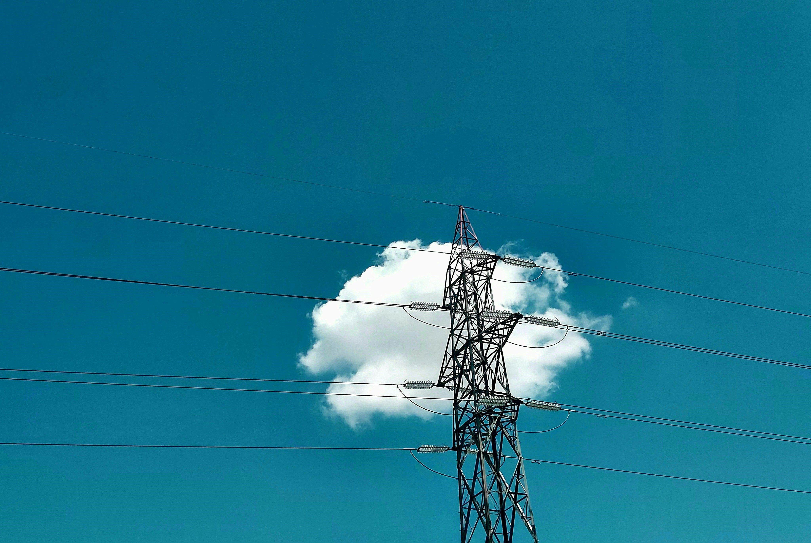

## Resources for Developers
Are you looking for ways to use machine learning to detect features such as shelters, solar panels or lighting on the ground using aerial imagery? [The Hive](https://github.com/USAFORUNHCRhive), USA for UNHCR’s data science and innovation lab, invites you to use these open repositories so you do not have to start from scratch. Learn more about how these repositories were created for better shelter planning of people forced to flee their homes due to war, conflict or persecution (see below). Let us know how you plan to use these repositories for your own purposes hive@unrefugees.org. 

  

    <h3>Electrical Infrastructure Identification</h3>
    <h4>Use aerial imagery to detect electrical poles and segment power distribution lines</h4>
    <h4><a href="https://github.com/USAFORUNHCRhive/turkana-grid-mapping">Repository with demo</a>&nbsp&nbsp&nbsp&nbsp&nbsp<a href="https://usaforunhcrhive.github.io/innovate4refugees_2024/grid-mapping-demo-instructions">Demo instructions</a></h4>
    
  

  

    <h3><a href="https://github.com/USAFORUNHCRhive/turkana-camp-roof-mapping">Building & Solar Panel Identification</a></h3>
    <h4>Use aerial imagery to detect buildings, solar panels and then classifiy the roof materials of buildings</h4>
    
  

## Overview: AI for Sustainable Settlements for Refugees
According to the UN Refugee Agency’s (UNHCR) 2023 Global Trends Report, approximately 22% of the 43 million refugees around the world live in camps — temporary facilities built to respond to specific emergencies. As the need for refugee housing grows, planning for refugee settlements has become more complex. To address this growing need, UNHCR is partnering with the tech sector to see how modern advances in artificial intelligence (AI) can be part of the solution.

To demonstrate how AI can address some of the most pressing issues in the humanitarian sector, Microsoft began a program in 2020 called AI for Humanitarian Action. [The Hive](https://github.com/USAFORUNHCRhive), USA for UNHCR’s data science and innovation lab, supported this initiative by conducting research to better understand what kinds of high-impact problems could be addressed with AI. Solutions for refugee settlement planning was one of the ideas that emerged from the work.

## The Problem
Humanitarian groups recognize that accurate and up-to-date maps are indispensable tools for enhancing the quality of life for communities in crisis. However, clear, accurate maps and aerial imagery of refugee settlements have not been easily available. Without access to maps, UNHCR field operations struggle to make informed decisions, plan for resource allocation and provide an improved standard of living for the residents of the camps.

## The Solution
Leverage advances in drone imagery to create open, accessible high resolution maps and use AI to help UNHCR field operations plan more accurately.

## The Kakuma and Kalobeyei Mapping Project Project
Over the course of the project, 102 drone flights, spanning 8.4K hectares, captured 161K images of data (near 3 terabytes). The images for Kakuma and Kalobeyei are available as part of HOT’s Open Aerial Map platform.

The higher resolution from drone imagery provides better data for AI models to achieve previously impossible levels of recognition of features on the ground such as tents, solar panels, latrines or even light poles. Mappers were trained to tag features in the images using an open-source tool called the HOT Task Manager that creates clear ways for both refugees in the camp and volunteers from around the world to work together. Over the course of several weeks, everyone worked to identify features within the camps including those listed above and even animal shelters, waste disposal areas, and community gathering spaces.

Once HOT’s mappers created the sample of features tagged, Microsoft AI for Good research scientists built 4 machine-learning models to automate the tagging for the other parts of the camp not tagged by mappers. The open-source code is available on GitHub for developers and civic technologists to use . Participants of The Hive’s annual forum [#Innovate4Refugees](https://www.unrefugees.org/innovate4refugees/) during the UN General Assembly week in September 2024 will be shown ways to use these models.

[Learn more about this project](https://www.unrefugees.org/news/kakuma-and-kalobeyei-drone-imagery-and-machine-learning-for-better-planning-of-refugee-settlements/)
