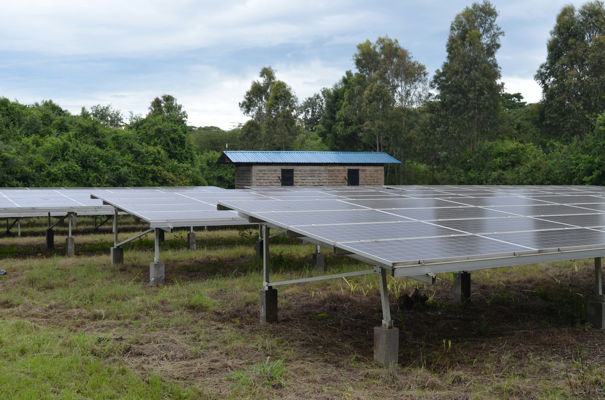

## Kakuma and Kalobeyei Mapping Project

Using drone imagery and AI models trained to recognize key topographical features, we can create open, accessible and high resolution maps to help UNCHR field operations plan more accurately.

102 drone flights carried out in Kakuma and Kalobeyei captured 161K images of data. Mappers were trained to tag features such as tents, solar panels, latrines or light poles using an open-source tool called the HOT Task Manager. Once HOT’s mappers created the sample of features tagged, Microsoft AI for Good research scientists built 4 machine-learning models to automate the tagging for the other parts of the camp not tagged by mappers. The open-source code is available on GitHub for developers and civic technologists to use, including demonstrations for how to use these models:

  

    <h3><a href="https://github.com/USAFORUNHCRhive/turkana-grid-mapping">Electrical Infrastructure Identification</a></h3>
    <h4>Use aerial imagery to detect electrical poles and segment power distribution. lines</h4>
    
  

  

    <h3><a href="https://github.com/USAFORUNHCRhive/turkana-camp-roof-mapping">Building & Solar Panel Identification</a></h3>
    <h4>Use aerial imagery to detect buildings, solar panels and then classifiy the roof materials of buildings.</h4>
    
  

 
[Learn more about this project](https://www.unrefugees.org/news/kakuma-and-kalobeyei-drone-imagery-and-machine-learning-for-better-planning-of-refugee-settlements/) &nbsp; &nbsp; &nbsp; [#Innovate4Refugees](https://www.unrefugees.org/innovate4refugees/)
